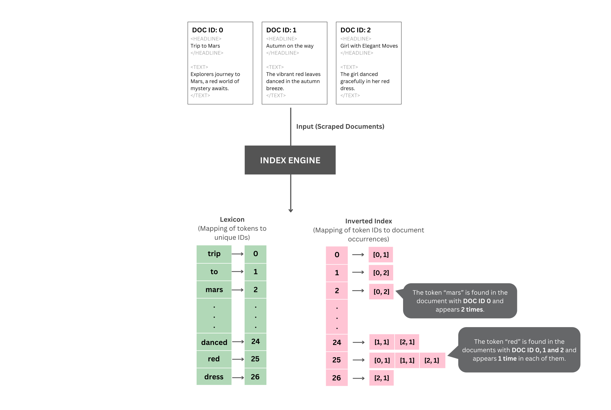
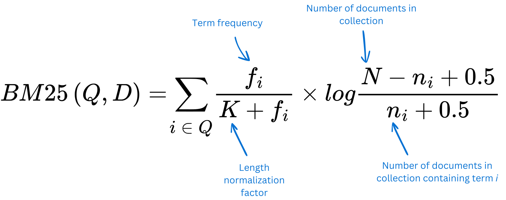

# Search Engine

## Description
This project was intended to apply the teachings from the lecture series on [Search Engines](https://www.youtube.com/@msci541-searchengines3). 

Data structures such as the lexicon & the inverted index are used to organize the parsed CBC News articles and locate them efficiently.



And using the BM25 ranking function to rank the retrieved document based on a score given a term in the query and the given document.



## Running the Project
Run the IndexEngine:
``` bash
cd Search.iv./engine/src/
make run-IndexEngine
```

Run the SearchEngine:
1. Run ui in localhost:3000
``` bash
cd Search.iv./ui/
npm run dev
```
2. Initialize Search Engine server
``` bash
cd Search.iv./demo/ 
./gradlew bootRun
```
3. Open localhost:3000 to use the browser user-interface